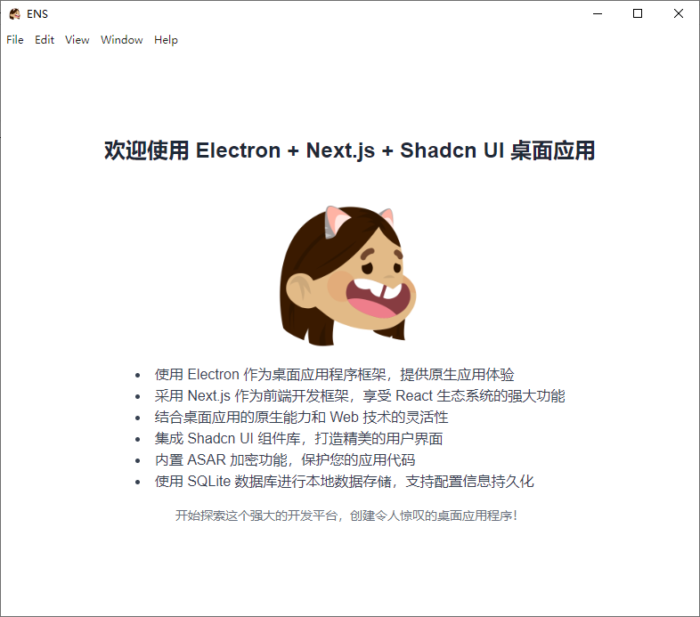

<div align="center">

# Electron + Next.js 桌面应用

[English](./README_EN.md) | 中文



🚀 现代化 | 🎨 美观 | 💻 跨平台

</div>

## 🌟 功能特点

- 🖥️ 使用 Electron 作为桌面应用程序框架，提供原生应用体验
- ⚛️ 采用 Next.js 作为前端开发框架，享受 React 生态系统的强大功能
- 🔧 结合桌面应用的原生能力和 Web 技术的灵活性
- 🎨 集成 Shadcn UI 组件库，打造精美的用户界面
- 🔐 内置 ASAR 加密功能，保护您的应用代码
- 💾 使用 SQLite 数据库进行本地数据存储，支持配置信息持久化
- 🚀 多线程支持，通过 Worker 处理耗时任务
- 🔄 批量数据操作，提高数据库读写效率
- 🔍 独立的 DevTools 窗口，提供更灵活的调试体验
- 🖼️ 自动图标生成，支持多平台图标格式
- 💻 跨平台支持：
  - Windows (7 及以上版本)
  - macOS (10.11 及以上版本)
  - Linux (Ubuntu, Fedora 等主流发行版)

## 🛠️ 技术栈

- Electron
- Next.js
- React
- TypeScript
- Tailwind CSS
- Shadcn UI
- SQLite
- Worker Threads

## 🚀 快速开始

### 环境要求

- Node.js (推荐版本 18.x 或更高)
- npm (通常随 Node.js 一起安装)

### 安装

1. 克隆项目仓库：
   ```bash
   git clone https://your-repository-url.git
   cd your-project-name
   ```

2. 安装依赖：
   ```bash
   npm install
   ```

### 运行

启动开发服务器：

```bash
npm run dev
```

这将同时启动 Next.js 开发服务器和 Electron 应用。

### 构建

构建生产版本：

```bash
npm run build
```

这将生成优化后的 Next.js 应用并打包 Electron 应用。

## 📁 项目结构

- `/main`: Electron 主进程代码
- `/src`: Next.js 应用代码
- `/resources`: 静态资源文件
- `/scripts`: 构建和加密脚本

## 🔐 安全性

本项目使用 ASAR 加密来保护应用代码。确保在 `.env` 文件中设置 `ENCRYPTION_KEY`：

```
ENCRYPTION_KEY=your_secure_encryption_key_here
```

⚠️ 注意：不要将包含实际密钥的 `.env` 文件提交到版本控制系统中。

## 🛠️ 开发工具

- ESLint: 代码质量检查
- Prettier: 代码格式化
- Concurrently: 并行运行多个命令
- Nodemon: 监视文件变化并自动重启应用

## 💻 开发特性

### DevTools 快捷键

在开发模式下，我们提供了一个方便的功能来快速访问 DevTools：

- **F12**: 在新窗口中打开 DevTools

这个功能允许开发者在应用运行时随时在新窗口中打开 DevTools，提供更灵活的调试体验。DevTools 窗口可以独立于主应用窗口移动和调整大小，方便进行更详细的调试工作。

### 本地数据存储

应用使用 SQLite 数据库进行本地数据存储，主要用于保存配置信息等数据：

- 数据库文件位于用户数据目录
- 提供了简单的 API 用于读写配置信息
- 支持在渲染进程中异步访问数据库
- 新增批量读取和写入功能，提高数据操作效率

开发者可以通过以下方法访问数据库：

- `window.electronAPI.getConfig(key)`: 获取单个配置
- `window.electronAPI.setConfig(key, value)`: 设置单个配置
- `window.electronAPI.batchGetConfig(keys)`: 批量获取配置
- `window.electronAPI.batchSetConfig(configs)`: 批量设置配置

### 多线程支持

为了提高应用性能，我们引入了 Worker 线程来处理耗时的计算任务：

- 使用 `window.electronAPI.runWorkerTask(taskType, data)` 在 Worker 中运行耗时任务

### 内存管理

应用实现了基本的内存管理机制：

- 设置了 100MB 的内存使用限制
- 当内存使用超过限制时，会自动触发垃圾回收

### 安全性增强

- 实现了内容安全策略（CSP），限制不必要的资源加载，减少内存使用和提高安全性

## 🎨 图标生成

本项目包含一个自动图标生成脚本，可以从单个源图像创建各种平台所需的图标格式：

1. 确保 `resources` 目录中有一个名为 `icon.png` 的高分辨率图像文件（建议至少 1024x1024 像素）。
2. 运行以下命令生成图标：

   ```bash
   npm run generate-icons
   ```

3. 生成的图标将保存在 `icon` 目录中：
   - `icon.ico` 用于 Windows
   - `icon.iconset` 目录用于 macOS（需要进一步处理）
   - 多个 PNG 文件用于 Linux

注意：对于 macOS，您需要在 macOS 系统上运行以下命令来创建 `.icns` 文件：

```
iconutil -c icns icon.iconset
```


## 🤝 贡献

我们欢迎并鼓励社区贡献！如果您想为项目做出贡献，请遵循以下步骤：

1. Fork 这个仓库
2. 创建您的性分支 (`git checkout -b feature/AmazingFeature`)
3. 提交您的更改 (`git commit -m 'Add some AmazingFeature'`)
4. 推送到分支 (`git push origin feature/AmazingFeature`)
5. 开启一个 Pull Request

更多详细信息将在未来的 CONTRIBUTING.md 文件中提供。

## 📄 许可证

本项目采用 MIT 许可证。详情请见 [LICENSE](LICENSE) 文件。

## 📞 联系我们

如有任何问题或建议，请开启一个 issue 或联系开发者 Harukite。

---

<div align="center">
  由 Harukite 使用 ❤️ 和 ☕ 制作
</div>

