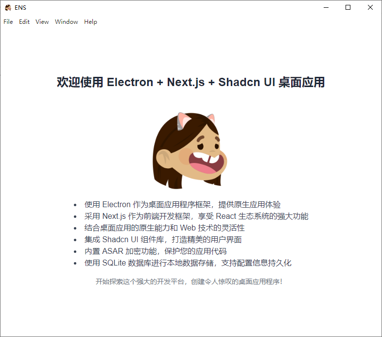

<div align="center">

# Electron + Next.js Desktop Application

English | [中文](./README.md)



🚀 Modern | 🎨 Beautiful | 💻 Cross-platform

</div>

## 🌟 Features

- 🖥️ Uses Electron as the desktop application framework, providing a native app experience
- ⚛️ Adopts Next.js as the front-end development framework, leveraging the power of the React ecosystem
- 🔧 Combines the native capabilities of desktop apps with the flexibility of Web technologies
- 🎨 Integrates Shadcn UI component library for creating beautiful user interfaces
- 🔐 Built-in ASAR encryption to protect your application code
- 💾 Uses SQLite database for local data storage, supporting persistent configuration information
- 🚀 Multi-threading support, handling time-consuming tasks through Workers
- 🔄 Batch data operations to improve database read/write efficiency
- 🔍 Independent DevTools window, providing a more flexible debugging experience
- 🖼️ Automatic icon generation, supporting multi-platform icon formats
- 💻 Cross-platform support:
  - Windows (version 7 and above)
  - macOS (version 10.11 and above)
  - Linux (Ubuntu, Fedora, and other major distributions)

## 🛠️ Technology Stack

- Electron
- Next.js
- React
- TypeScript
- Tailwind CSS
- Shadcn UI
- SQLite
- Worker Threads

## 🚀 Quick Start

### Requirements

- Node.js (version 18.x or higher recommended)
- npm (usually comes with Node.js)

### Installation

1. Clone the repository:
   ```bash
   git clone https://your-repository-url.git
   cd your-project-name
   ```

2. Install dependencies:
   ```bash
   npm install
   ```

### Running

Start the development server:
```bash
npm run dev
```

This will launch both the Next.js development server and the Electron application.

### Building

Build the production version:
```bash
npm run build
```

This will generate an optimized Next.js application and package the Electron app.

## 📁 Project Structure

- `/main`: Electron main process code
- `/src`: Next.js application code
- `/resources`: Static resource files
- `/scripts`: Build and encryption scripts

## 🔐 Security

This project uses ASAR encryption to protect the application code. Make sure to set `ENCRYPTION_KEY` in the `.env` file:

```javascript

ENCRYPTION_KEY=your_secure_encryption_key_here

```

⚠️ Note: Do not commit the `.env` file containing the actual key to version control systems.

## 🛠️ Development Tools

- ESLint: Code quality checking
- Prettier: Code formatting
- Concurrently: Running multiple commands in parallel
- Nodemon: Watching file changes and automatically restarting the application

## 💻 Development Features

### DevTools Shortcut

In development mode, we provide a convenient feature to quickly access DevTools:

- **F12**: Open DevTools in a new window

This feature allows developers to open DevTools in a new window at any time while the application is running, providing a more flexible debugging experience. The DevTools window can be moved and resized independently of the main application window, facilitating more detailed debugging work.

### Local Data Storage

The application uses SQLite database for local data storage, mainly for saving configuration information and other data:

- Database file is located in the user data directory
- Provides simple APIs for reading and writing configuration information
- Supports asynchronous database access in the renderer process
- Added batch read and write functionality to improve data operation efficiency

Developers can access the database through the following methods:

- `window.electronAPI.getConfig(key)`: Get a single configuration
- `window.electronAPI.setConfig(key, value)`: Set a single configuration
- `window.electronAPI.batchGetConfig(keys)`: Batch get configurations
- `window.electronAPI.batchSetConfig(configs)`: Batch set configurations

### Multi-threading Support

To improve application performance, we introduced Worker threads to handle time-consuming computation tasks:

- Use `window.electronAPI.runWorkerTask(taskType, data)` to run time-consuming tasks in a Worker

### Memory Management

The application implements basic memory management mechanisms:

- Set a 100MB memory usage limit
- Automatically triggers garbage collection when memory usage exceeds the limit

### Enhanced Security

- Implemented Content Security Policy (CSP) to limit unnecessary resource loading, reducing memory usage and improving security

## 🎨 Icon Generation

This project includes an automatic icon generation script that can create icon formats required by various platforms from a single source image:

1. Ensure there's a high-resolution image file named `icon.png` in the `resources` directory (recommended at least 1024x1024 pixels).
2. Run the following command to generate icons:

   ```bash
   npm run generate-icons
   ```

3. Generated icons will be saved in the `icon` directory:
   - `icon.ico` for Windows
   - `icon.iconset` directory for macOS (requires further processing)
   - Multiple PNG files for Linux

Note: For macOS, you need to run the following command on a macOS system to create the `.icns` file:


```bash 
cd icon 
iconutil -c icns icon.iconset
```

The generated icons will be automatically used in the application build process.

## 🤝 Contributing

We welcome and encourage community contributions! If you'd like to contribute to the project, please follow these steps:

1. Fork this repository
2. Create your feature branch (`git checkout -b feature/AmazingFeature`)
3. Commit your changes (`git commit -m 'Add some AmazingFeature'`)
4. Push to the branch (`git push origin feature/AmazingFeature`)
5. Open a Pull Request

More detailed information will be provided in the future CONTRIBUTING.md file.

## 📄 License

This project is licensed under the MIT License. See the [LICENSE](LICENSE) file for details.

## 📞 Contact Us

If you have any questions or suggestions, please open an issue or contact the developer Harukite.

---

<div align="center">
  Made with ❤️ and ☕ by Harukite
</div>